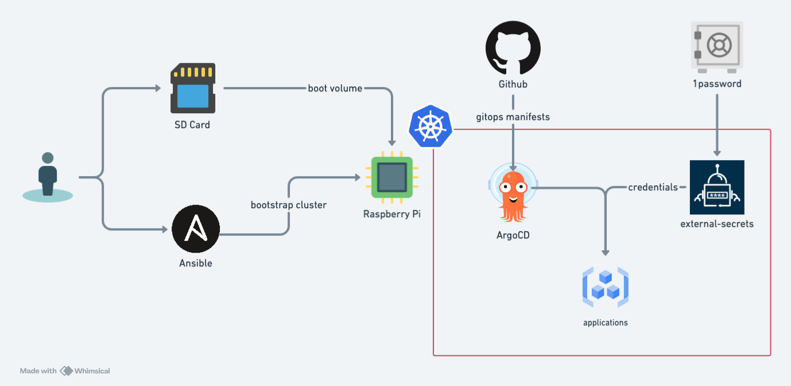

# HomeLab

A comprehensive Gitops driven Kubernetes setup running on Raspberry Pi(s).


## Overview

This repository contains the entire stack of the HomeLab K3S cluster setup, which aimed at

- Reliable (best-effort restrained by my home's condition)
- Fully Automated 
- Self Recoverable
- Auto-Upgrade (both components and the K3S itself)
- Secure
- Portable

The stack is chosen in a very opinionated way, you are welcomed to fork it and switch to your own choice ;)  

## Getting Started

The Cluster provisioning flow consists of 3 main steps:

- Initialize boot volume on RaspberryPi(s)
- Bootstrap the cluster with Ansible
- ArgoCD starts to reconcile the resources from Git



### Prerequisites

- [Ansible](https://docs.ansible.com/ansible/latest/installation_guide/intro_installation.html)
- [Taskfile](https://taskfile.dev/installation/)
- [1Password Connect]()

### Setting Up The Raspberry Pi 

- Download Ubuntu Server 22.04 LTS and burn it to SD card
- Run `./scripts/boot-init [id]` to configure the boot configure for RPi image, this includes
  - setup network configuration (modify as needed)
  - tune PoE+ fan speed
- Insert the SD Card to RPi and boot each node up.

### Install K3S with Ansible

- Configure the host information at `ansible/inventory.yaml` 
- Run `task install`
  - This will install the K3S cluster via Ansible


### Setup 1Password Connect

- Obtain the `1password-credentaisl.json` following the [guide](https://developer.1password.com/docs/connect/get-started?deploy=kubernetes&method=1password-com#step-1)
- Put the file at `credentials/1password-credentaisl.json`
- Run `task bootstrap`
  - This will install the 1password-connect/external-secrets/argocd for bootstrapping the IaC 
  
## Debug

```bash
ssh nandi@node_ip

> journalctl -u k3s.service -f
```

## Operations

### Rotate Certs


