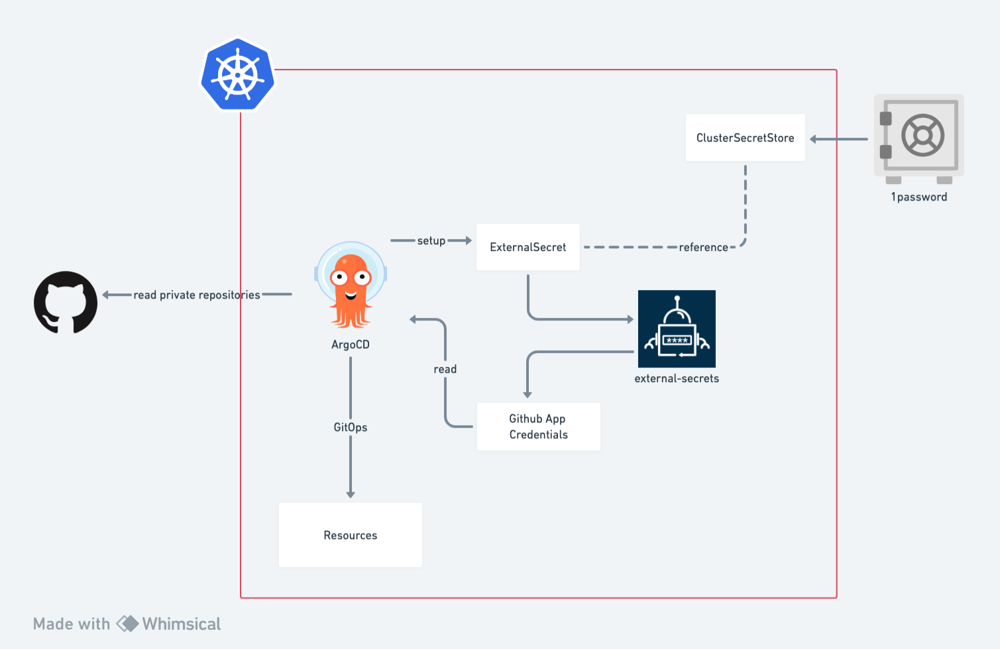

# HomeLab

This is a hobby project to set up a production ready bare-metal K3S cluster running on Raspberry Pi,

## Overview

Setting up Raspberry Pi is fun. Setting up a K3S cluster is fun. 
Setting up the IaC is fun.
But setting them all up is ... not fun.

This is a home-brew project aimed to break down all process into separate modules,
providing a simple enough yet self-explanatory procedure for each step.

Some Highlights:
- a shell script to set up the boot settings and k3s via cloud-init for the Raspberry Pi
- a shell script to download the kubeconfig
- terraform modules for setting up initial IaC configurations
  - remote vault with 1password connect
  - secret-store operator provided by external-secrets
  - ArgoCD setup to read private Github repository authenticated using Github App installation



## Getting Started

- Download Ubuntu 22.04 and burn it to SD card
- Run `./script/boot-init [id]` to configure the boot configure for RPi image, this includes
    - set up pre-requisities for running k3s
    - configure k3s
    - tune PoE+ fan speed
- Insert the SD Card to RPi and boot each node up. **Important**: Boot the master node first i.e. `./script/boot-init 0`.
- Get the kube config via `./script/setup-kubeconfig.sh` and you are good to go!

## Step 1. Setting Up K3S on New Raspberry Pi

Make your own config file: `cp ./config/config.ini.sample ./config/config.ini`

### Prepare The Network

The master node requires a static ip, 
configure the DHCP setting in your router to assign a static IP for the hostname `rpi-node-0`.

The prefix/master IP is configurable at `./config/config.ini`.

### Prepare Your Raspberry Pi

Prepare the boot device using [PI Imager](https://www.raspberrypi.com/software/), 
the init scripts is tested only on Ubuntu Server 22.04 LTS (64 Bit).
It is **HIGHLY RECOMMENDED** to use SSD storage as all intensive logging would exhaust the lifespan of SD card.

Once image is loaded to storage, run the following script to setup cloud-init:

```bash
# setup master node 
./scripts/boot-init 0

# to setup agent nodes, increment the number accordingly 
./scripts/boot-init 1
```

The script setup everything (network/user/k3s) for the Raspberry Pi using `cloud-init`. 

## Step 2. Setup ArgoCD using terraform

## Development

### Test `cloud-init` locally

Run [multipass](https://cloudinit.readthedocs.io/en/latest/howto/predeploy_testing.html#multipass) to validate the cloud-init.

```bash
./scripts/test-boot.sh
```

## Debug

```bash
ssh nandi@node_ip

> journalctl -u k3s.service -f
```

## Operations

### Rotate Certs


